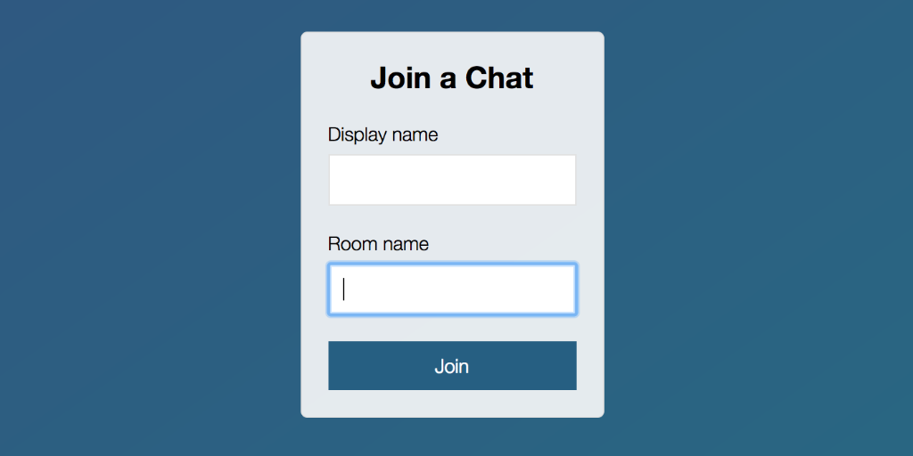

## Node.js Chat App

<kbd></kbd>

A chat app built with Node.js and socket.io. Includes unique (not secure) user login and private chat rooms as well as the ability to send your location to others in the same chat room using Google Maps API. Live version can be found [here](https://glacial-taiga-27544.herokuapp.com/). 

### Built With

* Node.js, Express, jQuery, socket.io
* Mocha & Expect libraries for testing
* Moment for time-stamping messages
* Mustache.js for HTML templates

### Future Plans

* Make chat rooms case insensitive
* Make usernames unique
* Add list of currently active chat rooms to choose from